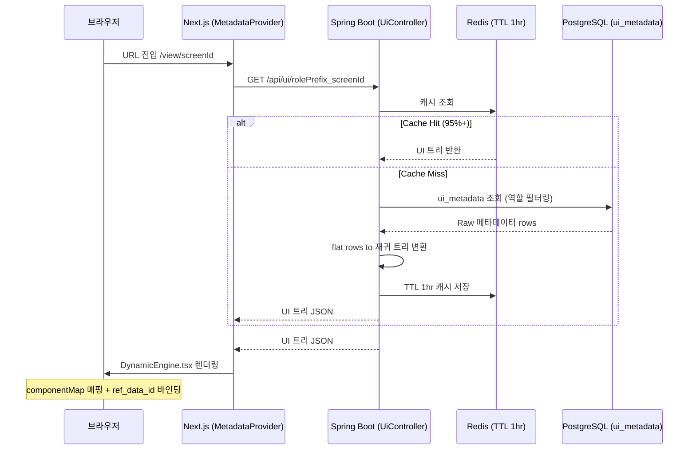

<div align="center">

# SDUI (Server-Driven UI) Engine

**"DB 한 줄로 화면이 바뀐다 — 클라이언트 배포 제로의 실시간 UI 아키텍처"**


<br/>

| 역할별 UI 전환 | DB 수정 → 즉시 반영 |
|:---:|:---:|
|  |  |
| GUEST → USER 전환 시 같은 URL, 완전히 다른 UI | DB row 1줄 수정 → 배포 없이 즉시 화면 반영 |

<br/>

| ⚡ UI 변경 배포 시간 | 🔄 컴포넌트 재사용률 | 🗄️ Redis 캐시 적용 | 🔐 인증 방식 |
|:---:|:---:|:---:|:---:|
| **0분** | **80%+** | **TTL 1hr** | **JWT + OAuth2(Kakao) + RBAC** |

<br/>

[](https://sdui-delta.vercel.app)


## 🚀  왜 SDUI인가? (Problem → Solution)

### 기존 방식의 한계

```
기획팀: "버튼 이름 하나만 바꿔주세요."

[ 기존 개발 프로세스 ]

기획 변경 요청
    ↓
개발자 코드 수정 (~30분)
    ↓
PR 생성 → 코드 리뷰 (~수 시간)
    ↓
CI/CD 빌드 · 테스트 (~10분)
    ↓
운영 서버 배포 (~20분)
    ↓
화면 반영 완료

총 소요: 수 시간 ~ 하루
개발자 컨텍스트 스위칭 발생
```

### SDUI가 만드는 차이

```
기획팀: "버튼 이름 하나만 바꿔주세요."

[ SDUI 프로세스 ]

DB ui_metadata 한 row 수정 (label_text 변경)
    ↓
브라우저 새로고침
    ↓
화면 반영 완료

총 소요: 30초
비개발자도 가능
코드 수정 0줄 · PR 0건 · 배포 0회
```

## 📌 프로젝트 개요

SDUI는 반복되는 프론트엔드 UI 수정과 하드코딩 배포 프로세스의 비효율을 해결하기 위해 기획된 **서버 중심 메타데이터 렌더링 엔진**입니다. 
UI의 구조(Component, Layout, Action)와 비즈니스 로직을 데이터베이스(`ui_metadata`)로 추상화하여, **단순 화면 변경 시 클라이언트 배포 없이 서버 설정만으로 즉각적인 런타임 업데이트가 가능**하도록 구현했습니다.

---

## 🏗 시스템 아키텍처 (Architecture & Data Flow)

### 🔄 핵심 렌더링 파이프라인
메타데이터 로딩 파이프라인에서 발생하는 RDBMS 부하를 막기 위해 **Redis 캐싱 계층**을 두어 Cache Hit 비율을 극대화했습니다.

```text
[ Client (Browser) ]
      │
      ▼ (URL 진입: /view/{screenId})
[ Next.js Middleware & Provider ] ──( 1. GET /api/ui/{screenId} 호출 )──▶ [ Spring Boot API ]
      │                                                                        │
      │                                    ┌──(Cache Hit)── [ Redis Cache (TTL 1hr) ]
      │                                    │
      │                                    └──(Cache Miss)─ [ PostgreSQL ui_metadata ]
      │
      ▼ (2. UI 트리 및 비즈니스 데이터 Fetch)
[ DynamicEngine.tsx ]
      │ 3. 컴포넌트 매핑 (ComponentMap.tsx)
      │ 4. 데이터 바인딩 (ref_data_id 연결)
      ▼
[ 동적 화면 렌더링 완료 렌더링 ]
```
---

## SDUI가 만드는 차이: 역할별 UI 전환 (RBAC + SDUI)

같은 URL, 같은 프론트엔드 코드 — DB 메타데이터만 다를 때 화면이 달라집니다.

| GUEST (비로그인) | USER (로그인) |
|:---:|:---:|
|  |  |
| 공개 컴포넌트만 렌더링 | 개인화된 컴포넌트 + 기능 활성화 |

> `MetadataProvider`는 React Query 키를 `${rolePrefix}_${screenId}` 형식으로 구성합니다.
> 백엔드는 이 키를 기반으로 역할에 맞는 메타데이터만 필터링하여 반환합니다.

---

## 핵심 컨셉: 메타데이터 → UI 렌더링 (SDUI in Action)

DB의 `ui_metadata` 테이블 한 row가 화면의 컴포넌트 하나가 됩니다.

| DB `ui_metadata` row | 렌더링 결과 |
|:---|:---|
| `component_type: INPUT` | 텍스트 입력 필드 |
| `component_type: BUTTON` + `action_type: LOGIN_SUBMIT` | 클릭 시 로그인 처리 버튼 |
| `component_type: TEXT` + `label_text: '안녕하세요'` | 정적 텍스트 |
| `group_direction: ROW` | 자식 컴포넌트를 가로 배치 (flex-row) |
| `group_direction: COLUMN` + `ref_data_id: diaryList` | 배열 데이터를 세로로 반복 렌더링 (Repeater) |

<!-- [TODO] metadata-to-ui.png 제작 후 아래 주석 해제 -->
<!--  -->

---

## 시스템 아키텍처 (Architecture & Data Flow)

### 핵심 렌더링 파이프라인



### 핵심 파일 구조

```
metadata-project/
├── components/
│   ├── DynamicEngine/
│   │   ├── DynamicEngine.tsx      # 메타데이터 트리 순회 & 렌더링 코어
│   │   ├── useDynamicEngine.tsx   # 데이터 바인딩 (formData > rowData > pageData)
│   │   └── hook/usePageHook.tsx   # 액션 라우터 (useUserActions | useBusinessActions)
│   └── constants/
│       ├── componentMap.tsx       # component_type → React 컴포넌트 매핑 테이블
│       └── screenMap.ts           # URL path → screenId 매핑
```

---

## 핵심 기술 의사결정 (Tech Reasoning)

### ① 데이터·UI 느슨한 결합 (`ref_data_id` 바인딩)

클라이언트 렌더링 엔진(`DynamicEngine`)과 서버 비즈니스 데이터(`query_master`)를
`ref_data_id` 식별자 하나로 느슨하게 연결했습니다.

```
ui_metadata.ref_data_id = "diaryList"
    ↕ (바인딩)
query_master.sql_key = "diaryList"
    → SELECT * FROM diary WHERE user_id = :userId
```

이 구조 덕분에 SQL 변경 없이 레이아웃 변경이 가능하고,
`group_direction: ROW ↔ COLUMN` 수정 한 줄로 반응형 뷰를 즉시 전환할 수 있습니다.

### ② 리피터(Repeater) 패턴 — 재귀 렌더링 최적화

리스트/게시판처럼 동일 구조가 반복되는 UI는 DB에 모든 자식을 하드맵핑하지 않습니다.

```
ref_data_id가 배열 타입일 경우:
  단일 템플릿 그룹 1개 → 배열 요소 수만큼 동적 복제

  diaryList = [{id:1, title:"일기1"}, {id:2, title:"일기2"}, ...]
      ↓ DynamicEngine Repeater
  [일기 카드 컴포넌트] × N개 렌더링
```

DB row 수를 최소화하면서 무한 확장이 가능한 리스트 렌더링을 구현했습니다.

### ③ Action Handler 분리 — OCP(개방-폐쇄 원칙) 적용

`usePageHook`이 모든 컴포넌트 이벤트를 가로채어 두 핸들러로 라우팅합니다.

```
컴포넌트 클릭
    ↓
usePageHook (액션 라우터)
    ├── userActionTypes 목록 해당 → useUserActions
    │   (LOGIN_SUBMIT, LOGOUT, REGISTER_SUBMIT, VERIFY_CODE ...)
    └── 그 외 → useBusinessActions
        (DIARY_WRITE, CONTENT_LIST, APPOINTMENT_BOOK ...)
```

새 액션 추가 시 기존 핸들러 수정 없이 각 훅에 case만 추가하면 됩니다.

---

## 기술 스택 (Tech Stack)

### Frontend Engine (`metadata-project`)

| 분류 | 기술 |
|------|------|
| Core | Next.js 15 (App Router), React 19, TypeScript |
| 상태 관리 | Zustand, TanStack Query (React Query) |
| 스타일링 | CSS Modules, 커스텀 CSS |
| 테스트 | Jest + React Testing Library (Unit), Playwright (E2E) |

### Backend Service (`SDUI-server`)

| 분류 | 기술 |
|------|------|
| Core | Java 17, Spring Boot 3.x |
| 인증/인가 | Spring Security, JWT, OAuth 2.0 (Kakao) |
| 데이터 | PostgreSQL (JSONB 활용), Flyway (마이그레이션) |
| 캐시 | Redis (TTL 전략, SQL 쿼리 캐시) |

### Infra & DevOps

| 분류 | 기술 |
|------|------|
| 프론트엔드 배포 | Vercel (자동 CI/CD) |
| 백엔드 배포 | AWS EC2 + GitHub Actions |
| 로컬 인프라 | Docker Compose (PostgreSQL + Redis) |

---

## AI-Assisted Development Workflow

본 프로젝트는 **1인 풀스택 설계·구현·배포** 환경에서, 코어 아키텍처는 직접 설계하되
반복 작업과 디버깅은 AI(Claude Code) 서브에이전트에게 위임하는 하이브리드 워크플로우를 채택했습니다.

### 직접 설계·통제한 영역 (Human)

- **아키텍처 설계**: `ui_metadata` 스키마, `ref_data_id` 바인딩 전략, Redis TTL 캐싱 정책
- **코어 로직**: `DynamicEngine` 재귀 트리 렌더링, Spring Security 인증/인가 파이프라인
- **최종 검수**: AI 작성 코드가 OCP·단일 책임 원칙에 부합하는지 리뷰 후 병합

### AI에게 위임한 영역 (Claude Code Agent)

- **보일러플레이트 생성**: `componentMap` 기반 다량의 폼 컴포넌트 반복 코드
- **트러블슈팅**: Vercel CSP 오류, DOM Props 충돌, React Query 캐시 불일치 등 파편화 이슈를 프롬프트 로그 기반으로 분석 후 수정 리포트 추출

> *"AI는 코드를 짜주지 않습니다. 명확한 아키텍처와 도메인 규칙을 주입했을 때, 비로소 강력한 서브엔지니어 도구로 동작합니다."*

---

## DB 엔티티 설계 고찰

### `ui_metadata` 핵심 구조

동적 화면을 구성하는 핵심 설계 테이블입니다.

| 컬럼 | 역할 |
|------|------|
| `screen_id` | 화면 단위 식별 키 (예: `LOGIN_PAGE`, `MAIN_PAGE`) |
| `component_type` | React 컴포넌트 1:1 매핑 (`INPUT`, `BUTTON`, `MODAL` 등) |
| `group_id` / `parent_group_id` | 부모-자식 컴포넌트 트리 계층 구조 형성 |
| `ref_data_id` | `query_master`의 데이터와 느슨한 바인딩 연결고리 |
| `action_type` | 클릭 이벤트 핸들러 라우팅 키 (`LOGIN_SUBMIT` 등) |
| `group_direction` | `ROW` → flex-row 레이아웃 / `COLUMN` → flex-col 레이아웃 |
| `allowed_roles` | RBAC 역할 필터링 (`ROLE_USER`, `ROLE_GUEST`, NULL=전체) |

### `query_master` 핵심 구조

동적 데이터 조회를 위한 SQL 저장소입니다.

| 컬럼 | 역할 |
|------|------|
| `sql_key` | `ref_data_id`와 매핑되는 식별 키 |
| `sql_query` | 실행할 SQL (`:userId` 등 바인딩 파라미터 포함) |
| Redis 캐시 | `SQL:{sqlKey}` 키로 TTL 적용 캐싱 |

---

## 로컬 실행 방법 (Getting Started)

### 사전 요구사항

- Docker Desktop
- Java 17+
- Node.js 18+

### 1. 인프라 실행 (PostgreSQL + Redis)

```bash
docker-compose up -d
```

### 2. 백엔드 실행

```bash
cd SDUI-server
./gradlew bootRun
```

### 3. 프론트엔드 실행

```bash
cd metadata-project
npm install
npm run dev
```

브라우저에서 `http://localhost:3000` 접속

---

<div align="center">

**Developed by Min Yerin**
*1인 풀스택 설계 · 구현 · 배포 (2026)*

[](https://github.com/feed-mina)
[](mailto:myelin24@naver.com)

</div>
